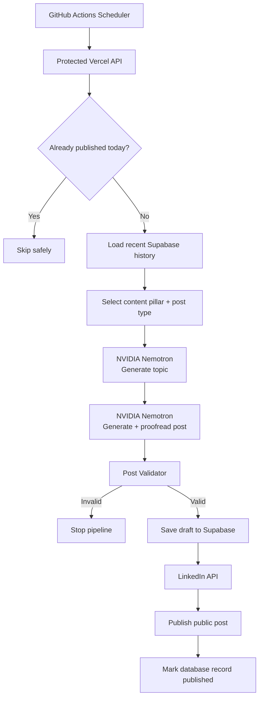

<div align="center">

# PostPilot

### Autonomous AI-powered LinkedIn content generation and publishing

PostPilot is an open-source Node.js service that plans, generates, validates, stores, and publishes LinkedIn posts automatically using NVIDIA Nemotron, Supabase, LinkedIn OAuth, Vercel, and GitHub Actions.

[](LICENSE)
[](https://nodejs.org/)
[](https://expressjs.com/)
[](https://build.nvidia.com/)
[](https://supabase.com/)
[](https://vercel.com/)
[](https://github.com/features/actions)

[Getting Started](#getting-started) · [Architecture](#architecture) · [API](#api-reference) · [Contributing](CONTRIBUTING.md) · [Security](SECURITY.md)

**Demo health endpoint:** https://postpilot-omega-gilt.vercel.app/health

</div>

---

## Overview

PostPilot automates the full LinkedIn content pipeline instead of only generating text.

It can:

1. select a weighted content pillar and post type,
2. read recent post history to reduce repetition,
3. generate a fresh topic with NVIDIA Nemotron,
4. generate and proofread the LinkedIn post,
5. validate the content before publication,
6. save the draft to Supabase,
7. publish through the LinkedIn API,
8. record the publication result,
9. skip safely when a post has already been published that day,
10. run automatically from GitHub Actions.

The reference production deployment is scheduled for **09:00 AM IST daily**.

> PostPilot is open source, but credentials are not. Every self-hosted deployment must use its own NVIDIA, Supabase, LinkedIn, Vercel, and GitHub credentials.

---

## Architecture



---

## Core features

- **Autonomous scheduling** with GitHub Actions.
- **NVIDIA Nemotron generation** using `nvidia/nemotron-3-nano-30b-a3b` by default.
- **Weighted content strategy** across several engineering themes.
- **Recent-post memory** backed by Supabase.
- **Two-pass generation** with a dedicated proofreading pass.
- **Pre-publish validation** for formatting, unsupported claims, reasoning leakage, URLs, hashtag limits, and more.
- **Retry handling** around external AI and publishing calls.
- **Explicit NVIDIA request timeouts**.
- **LinkedIn OAuth 2.0** authentication.
- **Encrypted LinkedIn token storage** using authenticated encryption.
- **Bearer-protected API endpoints**.
- **Daily duplicate protection** based on `Asia/Kolkata`.
- **GitHub Actions concurrency control** to prevent overlapping scheduled runs.
- **Failure-state persistence** in Supabase.
- **Vercel-compatible Express deployment**.

---

## Content strategy

| Content pillar | Weight |
| --- | ---: |
| AI & Machine Learning | 30% |
| Web Development | 25% |
| Building Projects | 20% |
| Developer Career | 15% |
| Lessons & Observations | 10% |

Supported post types:

- Educational
- Technical Tip
- Project Update
- Technical Opinion
- Mistake & Lesson
- Mini Case Study
- Mini Tutorial
- Engineering Observation

---

## Tech stack

| Layer | Technology |
| --- | --- |
| Runtime | Node.js with ES Modules |
| Backend | Express 5 |
| AI | NVIDIA NIM / Nemotron |
| Database | Supabase PostgreSQL |
| Authentication | LinkedIn OAuth 2.0 |
| Publishing | LinkedIn Posts API |
| Hosting | Vercel |
| Scheduler | GitHub Actions |
| Secrets | Environment variables + GitHub Actions Secrets |

---

## Project structure

```text
Postpilot/
├── .github/
│   ├── ISSUE_TEMPLATE/
│   ├── PULL_REQUEST_TEMPLATE.md
│   └── workflows/
│       └── daily-linkedin-post.yml
├── scripts/                  # Service and integration tests
├── src/
│   ├── config/               # Environment, database, strategy config
│   ├── controllers/          # HTTP controllers
│   ├── jobs/                 # Autonomous daily posting pipeline
│   ├── middleware/           # Bearer-secret authorization
│   ├── prompts/              # Prompt builders
│   ├── routes/               # Express routes
│   ├── services/             # NVIDIA, LinkedIn, DB, validation services
│   ├── utils/                # Retry utilities
│   └── index.js              # Express application entry point
├── supabase/
│   └── schema.sql            # Reproducible database schema
├── .env.example
├── CODE_OF_CONDUCT.md
├── CONTRIBUTING.md
├── LICENSE
├── SECURITY.md
├── package.json
└── README.md
```

---

## Getting started

### Prerequisites

You need:

- Node.js
- an NVIDIA API key
- a Supabase project
- a LinkedIn Developer App with member-posting capability
- GitHub Actions if you want scheduled automation
- Vercel or another Node-compatible host for production deployment

### 1. Clone the repository

```bash
git clone https://github.com/Sudip-C/Postpilot.git
cd Postpilot
```

### 2. Install dependencies

```bash
npm install
```

### 3. Create your Supabase tables

Open the Supabase SQL Editor and run:

```text
supabase/schema.sql
```

The schema creates the required `posts` and `linkedin_tokens` tables, indexes, constraints, and enables RLS without adding public browser policies.

### 4. Configure environment variables

Copy the example file:

```bash
cp .env.example .env
```

PowerShell:

```powershell
Copy-Item .env.example .env
```

Then populate your own values:

```env
PORT=3000

DAILY_JOB_SECRET=

NVIDIA_API_KEY=
NVIDIA_API_URL=https://integrate.api.nvidia.com/v1/chat/completions
NVIDIA_MODEL=nvidia/nemotron-3-nano-30b-a3b

SUPABASE_URL=
SUPABASE_SECRET_KEY=

LINKEDIN_CLIENT_ID=
LINKEDIN_CLIENT_SECRET=
LINKEDIN_REDIRECT_URI=http://localhost:3000/auth/linkedin/callback
LINKEDIN_TOKEN_ENCRYPTION_KEY=
LINKEDIN_API_VERSION=202608
```

Never commit `.env`, API keys, OAuth client secrets, encryption keys, access tokens, or privileged Supabase credentials.

### 5. Start PostPilot

```bash
npm start
```

Development mode:

```bash
npm run dev
```

Verify the server:

```bash
curl http://localhost:3000/health
```

Expected response:

```json
{
  "status": "ok",
  "service": "PostPilot"
}
```

---

## NVIDIA setup

PostPilot uses NVIDIA's OpenAI-compatible chat-completions API.

Default model:

```text
nvidia/nemotron-3-nano-30b-a3b
```

The NVIDIA client includes response validation, explicit timeout handling, and thinking/reasoning suppression. The daily job adds retries around generation calls.

Test the connection:

```bash
npm run test:nvidia
```

Test the complete generator:

```bash
npm run test:generator
```

---

## Supabase setup

The complete starter schema is included at:

```text
supabase/schema.sql
```

### `posts`

Stores generated content and publication state, including:

- topic,
- content pillar,
- post type,
- final content,
- status,
- LinkedIn publication ID,
- error information,
- creation and publication timestamps.

### `linkedin_tokens`

Stores encrypted OAuth token material. Access tokens are encrypted before they are written to Supabase; plaintext tokens are not intentionally persisted in the table.

Use a **backend-only Supabase secret key**. Do not place privileged Supabase credentials in browser-side code.

---

## LinkedIn OAuth setup

Create a LinkedIn Developer App and enable the products/scopes needed for member posting.

PostPilot uses scopes including:

```text
openid profile w_member_social
```

For local development, register:

```text
http://localhost:3000/auth/linkedin/callback
```

Start the OAuth flow at:

```text
http://localhost:3000/auth/linkedin
```

For production, replace the redirect URI with your own deployed domain and register the exact callback URL in LinkedIn's Developer Portal.

After successful authorization, PostPilot exchanges the authorization code server-side and stores the resulting token encrypted in Supabase.

---

## API reference

### Health check

```http
GET /health
```

No authentication required.

### Generate a post manually

```http
POST /api/posts/generate
Authorization: Bearer <DAILY_JOB_SECRET>
Content-Type: application/json
```

```json
{
  "topic": "Why developers should learn AI integration"
}
```

### Publish text manually

```http
POST /api/posts/publish
Authorization: Bearer <DAILY_JOB_SECRET>
Content-Type: application/json
```

```json
{
  "content": "Your validated LinkedIn post text"
}
```

### Trigger the autonomous daily job

```http
POST /api/jobs/daily-post
Authorization: Bearer <DAILY_JOB_SECRET>
```

If a post has already been published during the current `Asia/Kolkata` calendar day, the endpoint returns a successful skip result instead of publishing again.

> Keep `DAILY_JOB_SECRET` server-side. Never expose it in frontend JavaScript.

---

## Automated scheduling

The scheduler is defined in:

```text
.github/workflows/daily-linkedin-post.yml
```

Reference schedule:

```yaml
- cron: "30 3 * * *"
```

GitHub Actions cron uses UTC, so `03:30 UTC` is **09:00 AM IST**.

Required repository secrets:

```text
POSTPILOT_API_URL
DAILY_JOB_SECRET
```

The workflow includes concurrency protection:

```yaml
concurrency:
  group: postpilot-daily-linkedin-post
  cancel-in-progress: false
```

Self-hosters can change the cron schedule to any cadence they prefer.

---

## Validation and safety

Generated content must pass validation before it can be published. Checks include:

- hashtag limits,
- URLs,
- reasoning or chain-of-thought leakage,
- fabricated personal experience,
- unsupported recruiter/hiring claims,
- suspicious joined words or spacing,
- content-length constraints.

Invalid content stops the pipeline before LinkedIn publishing.

---

## Reliability and failure handling

PostPilot is designed to fail closed rather than publish questionable output.

- Generation calls are retried.
- LinkedIn publishing is retried.
- NVIDIA requests have explicit timeouts.
- Drafts are stored before publication.
- Failed publication attempts are recorded.
- Same-day duplicate runs are skipped.
- Concurrent scheduler runs are serialized.

---

## Test commands

```bash
npm run test:nvidia
npm run test:prompt
npm run test:generator
npm run test:pillars
npm run test:post-types
npm run test:selector
npm run test:supabase
npm run test:posts-table
npm run test:save-post
npm run test:recent-posts
npm run test:linkedin-token
npm run test:linkedin-api
npm run test:validator
npm run test:retry
npm run test:failure
npm run test:job-auth
```

The following commands may interact with real external services and should be used deliberately:

```bash
npm run test:linkedin-publish
npm run daily-post
```

They can create real public LinkedIn posts when valid credentials are configured.

---

## Deployment

The Express application exports the app instance for serverless deployment while only opening a local listener outside production.

For Vercel:

1. import your fork/repository,
2. configure all required environment variables,
3. deploy,
4. verify `/health`,
5. update `LINKEDIN_REDIRECT_URI` to your production callback,
6. register that exact callback in LinkedIn,
7. configure GitHub Actions secrets if scheduled posting is desired.

You are not required to use Vercel; any compatible Node.js hosting environment can be used with appropriate deployment changes.

---

## Security model

PostPilot can publish to a real LinkedIn account, so credential isolation is a core design requirement.

- `.env` files are ignored by Git.
- Tokens are encrypted before database storage.
- Encryption keys remain server-side.
- Supabase privileged credentials remain server-side.
- Publishing and generation endpoints require bearer authentication.
- GitHub Actions reads secrets from repository secrets.
- No production credentials are intentionally included in this repository.

See [SECURITY.md](SECURITY.md) for vulnerability reporting.

---

## LinkedIn token expiry

LinkedIn access tokens have a finite lifetime. If your OAuth response does not include a refresh token, the deployment will eventually require reauthorization.

Open your own deployment's:

```text
/auth/linkedin
```

to run the OAuth flow again.

A future improvement is proactive token-expiry monitoring and notification.

---

## Contributing

Contributions are welcome.

Before contributing, read:

- [CONTRIBUTING.md](CONTRIBUTING.md)
- [CODE_OF_CONDUCT.md](CODE_OF_CONDUCT.md)
- [SECURITY.md](SECURITY.md)

The repository includes structured bug-report and feature-request forms plus a pull-request template.

Good first contribution areas include:

- token-expiry alerts,
- test coverage,
- deployment documentation,
- observability,
- approval workflows,
- analytics,
- better distributed locking,
- additional content strategies.

---

## Roadmap

Potential future improvements:

- LinkedIn token-expiry alerts
- Administrative dashboard
- Post preview and approval mode
- Engagement analytics
- Automatic topic-performance learning
- Image/carousel post generation
- Multi-account support
- Structured observability and alerting
- Stronger database-level distributed locking

---

## Open-source license

PostPilot is released under the [MIT License](LICENSE).

You may use, copy, modify, merge, publish, distribute, sublicense, and sell copies of the software subject to the terms of that license.

Third-party services such as LinkedIn, NVIDIA, Supabase, GitHub, and Vercel remain subject to their own terms, policies, quotas, and API requirements.

---

<div align="center">

**PostPilot — plan, generate, validate, publish.**

Open source under MIT.

</div>
