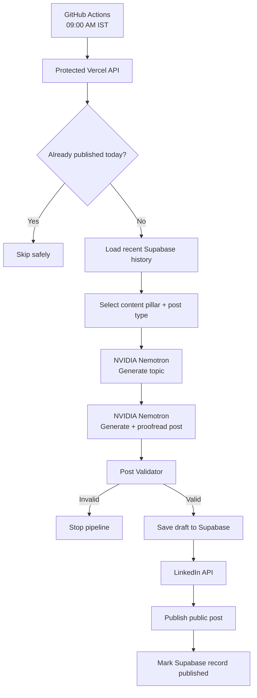

<div align="center">

# PostPilot

### Autonomous AI-powered LinkedIn content generation and publishing

PostPilot is a production-deployed Node.js service that plans, generates, validates, stores, and publishes a fresh LinkedIn post every day with minimal manual intervention.

[](https://nodejs.org/)
[](https://expressjs.com/)
[](https://build.nvidia.com/)
[](https://supabase.com/)
[](https://vercel.com/)
[](https://github.com/features/actions)

**Live health endpoint:** https://postpilot-omega-gilt.vercel.app/health

</div>

---

## What PostPilot does

PostPilot runs an end-to-end content pipeline for LinkedIn:

1. Selects a weighted content pillar and post format.
2. Reads recent post history from Supabase to reduce repetition.
3. Generates a fresh topic with NVIDIA Nemotron.
4. Generates and proofreads the LinkedIn post.
5. Validates the output before anything is published.
6. Saves the post as a draft in Supabase.
7. Publishes through the LinkedIn API.
8. Marks the database record as published with the LinkedIn post ID.
9. Prevents duplicate posts on the same India calendar day.
10. Runs automatically every day through GitHub Actions.

The current production schedule is **09:00 AM IST daily**.

---

## Architecture



---

## Core features

- **Autonomous daily publishing** via GitHub Actions.
- **NVIDIA Nemotron generation** using `nvidia/nemotron-3-nano-30b-a3b`.
- **Weighted content strategy** instead of choosing topics completely at random.
- **Recent-post memory** backed by Supabase.
- **Two-pass generation** with a dedicated proofreading pass.
- **Content validation** for length, hashtags, URLs, reasoning leakage, fabricated experience, unsupported hiring claims, and suspicious formatting.
- **Retry handling** for transient AI and LinkedIn failures.
- **Failure tracking** in the database.
- **LinkedIn OAuth 2.0** authentication.
- **Encrypted LinkedIn token storage**.
- **Protected API endpoints** using a server-side bearer secret.
- **Daily duplicate protection** based on the `Asia/Kolkata` calendar day.
- **GitHub Actions concurrency control** to avoid overlapping scheduler runs.
- **Production deployment on Vercel**.

---

## Content strategy

PostPilot uses weighted content pillars so the feed stays focused while still rotating through multiple themes.

| Content pillar | Weight |
| --- | ---: |
| AI & Machine Learning | 30% |
| Web Development | 25% |
| Building Projects | 20% |
| Developer Career | 15% |
| Lessons & Observations | 10% |

Supported post types include:

- Educational
- Technical Tip
- Project Update
- Technical Opinion
- Mistake & Lesson
- Mini Case Study
- Mini Tutorial
- Engineering Observation

---

## Tech stack

| Layer | Technology |
| --- | --- |
| Runtime | Node.js with ES Modules |
| Backend | Express 5 |
| AI | NVIDIA NIM / Nemotron |
| Database | Supabase PostgreSQL |
| Authentication | LinkedIn OAuth 2.0 |
| Publishing | LinkedIn Posts API |
| Hosting | Vercel |
| Scheduler | GitHub Actions |
| Secrets | Vercel Environment Variables + GitHub Actions Secrets |

---

## Project structure

```text
Postpilot/
├── .github/
│   └── workflows/
│       └── daily-linkedin-post.yml
├── scripts/                  # Integration and service tests
├── src/
│   ├── config/               # Environment, Supabase, strategy config
│   ├── controllers/          # HTTP controllers
│   ├── jobs/                 # Daily autonomous posting pipeline
│   ├── middleware/           # Protected-job authorization
│   ├── prompts/              # LinkedIn generation prompt builders
│   ├── routes/               # Express routes
│   ├── services/             # NVIDIA, LinkedIn, DB, validation services
│   ├── utils/                # Retry utilities
│   └── index.js              # Express application entry point
├── .env.example
├── package.json
└── README.md
```

---

## Getting started

### 1. Clone the repository

```bash
git clone https://github.com/Sudip-C/Postpilot.git
cd Postpilot
```

### 2. Install dependencies

```bash
npm install
```

### 3. Configure environment variables

Create a `.env` file in the project root:

```env
PORT=3000

DAILY_JOB_SECRET=

NVIDIA_API_KEY=
NVIDIA_API_URL=https://integrate.api.nvidia.com/v1/chat/completions
NVIDIA_MODEL=nvidia/nemotron-3-nano-30b-a3b

SUPABASE_URL=
SUPABASE_SECRET_KEY=

LINKEDIN_CLIENT_ID=
LINKEDIN_CLIENT_SECRET=
LINKEDIN_REDIRECT_URI=http://localhost:3000/auth/linkedin/callback
LINKEDIN_TOKEN_ENCRYPTION_KEY=
LINKEDIN_API_VERSION=202608
```

Never commit your `.env` file, API keys, OAuth client secret, encryption key, or LinkedIn access token.

### 4. Start the server

```bash
npm start
```

Development mode:

```bash
npm run dev
```

Verify the service:

```bash
curl http://localhost:3000/health
```

Expected response:

```json
{
  "status": "ok",
  "service": "PostPilot"
}
```

---

## NVIDIA setup

PostPilot uses NVIDIA's OpenAI-compatible chat-completions endpoint.

Current production model:

```text
nvidia/nemotron-3-nano-30b-a3b
```

The AI client includes:

- configurable timeout handling,
- JSON response validation,
- thinking/reasoning suppression,
- retry support at the job layer.

Test the connection:

```bash
npm run test:nvidia
```

Test the complete post generator:

```bash
npm run test:generator
```

---

## Supabase setup

PostPilot stores generated content and encrypted LinkedIn credentials in Supabase.

### `posts` table

Core fields used by the service:

| Column | Purpose |
| --- | --- |
| `id` | UUID primary key |
| `topic` | Generated post topic |
| `pillar_id` | Selected content pillar |
| `post_type_id` | Selected post format |
| `content` | Final generated LinkedIn content |
| `status` | `draft`, `approved`, `published`, or `failed` |
| `linkedin_post_id` | LinkedIn publication URN |
| `error_message` | Failure information |
| `created_at` | Creation timestamp |
| `published_at` | Successful publication timestamp |

### `linkedin_tokens` table

LinkedIn access tokens are encrypted before storage. The database stores ciphertext plus the IV/authentication metadata required for authenticated decryption rather than storing the access token as plaintext.

Use a backend-only Supabase secret key. Do not expose it to browser code.

---

## LinkedIn OAuth setup

Create a LinkedIn Developer application and enable the permissions/products required for member posting.

PostPilot requests the scopes needed for profile identification and posting, including:

```text
openid profile w_member_social
```

For local development, register:

```text
http://localhost:3000/auth/linkedin/callback
```

For the current production deployment, register:

```text
https://postpilot-omega-gilt.vercel.app/auth/linkedin/callback
```

Start the OAuth flow locally:

```text
http://localhost:3000/auth/linkedin
```

Production:

```text
https://postpilot-omega-gilt.vercel.app/auth/linkedin
```

After successful authorization, PostPilot exchanges the authorization code server-side and stores the resulting access token encrypted in Supabase.

---

## API reference

### Health check

```http
GET /health
```

No authentication required.

### Generate a post manually

```http
POST /api/posts/generate
Authorization: Bearer <DAILY_JOB_SECRET>
Content-Type: application/json
```

```json
{
  "topic": "Why developers should learn AI integration"
}
```

### Publish text manually

```http
POST /api/posts/publish
Authorization: Bearer <DAILY_JOB_SECRET>
Content-Type: application/json
```

```json
{
  "content": "Your validated LinkedIn post text"
}
```

### Trigger the autonomous daily job

```http
POST /api/jobs/daily-post
Authorization: Bearer <DAILY_JOB_SECRET>
```

The daily endpoint can return a successful skip response when a post has already been published during the current `Asia/Kolkata` calendar day.

> **Security:** The generation, publishing, and daily-job endpoints are protected. Never expose `DAILY_JOB_SECRET` in frontend code or commit it to Git.

---

## Automated scheduling

The production scheduler lives at:

```text
.github/workflows/daily-linkedin-post.yml
```

Schedule:

```yaml
- cron: "30 3 * * *"
```

GitHub Actions cron uses UTC, so `03:30 UTC` corresponds to **09:00 AM IST**.

Required GitHub repository secrets:

```text
POSTPILOT_API_URL
DAILY_JOB_SECRET
```

The workflow also uses a concurrency group:

```yaml
concurrency:
  group: postpilot-daily-linkedin-post
  cancel-in-progress: false
```

This prevents overlapping scheduler executions. Database-level daily checking adds a second layer of duplicate protection.

---

## Validation and safety checks

A generated post must pass validation before it can be saved and published. The validator checks for issues such as:

- excessive hashtags,
- URLs,
- AI reasoning or chain-of-thought leakage,
- fabricated personal/career experience,
- unsupported recruiter or hiring-market claims,
- suspicious joined words/spacing,
- invalid content length.

Invalid content stops the pipeline before LinkedIn publishing.

---

## Reliability and failure handling

PostPilot is designed to fail closed rather than publish questionable output.

- Topic generation is retried on transient failures.
- Post generation is retried.
- LinkedIn publishing is retried.
- NVIDIA requests have an explicit timeout.
- Failed publication attempts are recorded with `status = failed`.
- Drafts are stored before publishing.
- Already-published days return a safe skip result.
- Concurrent GitHub workflow executions are serialized.

---

## Test commands

The repository includes focused scripts for individual subsystems.

```bash
npm run test:nvidia
npm run test:prompt
npm run test:generator
npm run test:pillars
npm run test:post-types
npm run test:selector
npm run test:supabase
npm run test:posts-table
npm run test:save-post
npm run test:recent-posts
npm run test:linkedin-token
npm run test:linkedin-api
npm run test:validator
npm run test:retry
npm run test:failure
npm run test:job-auth
```

The following command executes the real daily pipeline and can publish to LinkedIn when configured with production-capable credentials:

```bash
npm run daily-post
```

Use publishing tests and the daily job deliberately because they can create real public LinkedIn posts.

---

## Deployment on Vercel

The Express app exports the application instance for Vercel while only opening a local listener outside production.

Configure all production secrets in **Vercel → Project Settings → Environment Variables**, then deploy the repository.

Production base URL:

```text
https://postpilot-omega-gilt.vercel.app
```

After deployment, verify:

```text
GET https://postpilot-omega-gilt.vercel.app/health
```

---

## Security model

PostPilot handles credentials that can publish content to a real LinkedIn account, so secrets are intentionally kept server-side.

- `.env` is ignored by Git.
- LinkedIn access tokens are encrypted before database storage.
- The encryption key remains in server environment variables.
- Supabase privileged credentials remain backend-only.
- Publishing and generation routes require bearer authentication.
- GitHub Actions receives secrets through repository secrets.
- The public repository contains no production credentials.

If a credential is ever exposed, rotate it immediately in the corresponding provider and update Vercel/GitHub secrets.

---

## Operational note: LinkedIn token expiry

The current LinkedIn OAuth response does not provide a refresh token. The access token therefore has a finite lifetime.

When it expires, reauthorize PostPilot through:

```text
https://postpilot-omega-gilt.vercel.app/auth/linkedin
```

A future version can add token-expiry monitoring and notification before the token becomes invalid.

---

## Roadmap

Potential next improvements:

- LinkedIn token-expiry alerts
- Administrative dashboard
- Post preview and approval mode
- Engagement analytics
- Automatic topic-performance learning
- Image/carousel post generation
- Multi-account support
- Structured observability and alerting
- Stronger database-level distributed locking

---

## Production status

The complete production path has been tested successfully:

```text
GitHub Actions
   → Vercel
   → NVIDIA Nemotron
   → Validator
   → Supabase
   → LinkedIn API
   → Public LinkedIn post
```

A second same-day workflow execution was also tested and correctly skipped without creating a duplicate post.

---

## License

This project currently uses the **ISC License** as declared in `package.json`.

---

<div align="center">

Built as an autonomous AI content-engineering project.

**PostPilot — plan, generate, validate, publish.**

</div>
